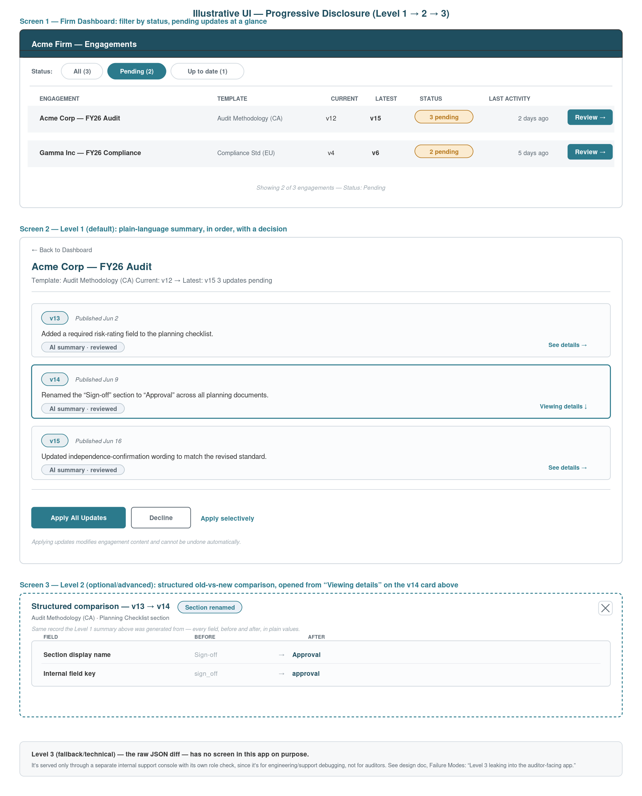

# Product Template Update Tracking — Submission

**Problem, in one sentence:** keep an up-to-date, cheap-to-query picture of how far behind each engagement is from its template's latest version — without paying the 1-minute-per-engagement load cost — and present the accumulated changes in a form a non-technical auditor can act on.

## Contents

| File | What it is |
|---|---|
| `Design Document.pdf` | Part 1 — the 3-page design doc (architecture, implementation plan, testing strategy, evaluation & observability, failure modes & tradeoffs). |
| `architecture-diagram.png` | Component / data-flow diagram referenced in the design doc. |
| `ui-wireframe.png` | Illustrative UI (below) — not required by the brief, included to make the "human-readable summary" and "pending updates at a glance" requirements concrete. |
| `tracking_service.py` | Part 2 (optional) — the targeted implementation slice: the `EngagementTemplateState` index service (event handlers + read paths). |
| `test_tracking_service.py` | Unit tests for the slice: idempotency, out-of-order events, multi-hop accumulation, fan-out scoping. |

## UI (illustrative) — progressive disclosure

Three screens, showing the same v13→v14 change at two levels of detail, plus the dashboard that gets you there:

1. **Firm dashboard** — filterable by status, shows only what's pending.
2. **Level 1 (default)** — plain-language, per-version summaries in order, each flagged as an AI-generated summary that's been reviewed, leading to the apply/decline decision.
3. **Level 2 (optional/advanced)** — a structured old-vs-new comparison for that same version hop: field names and values, before and after, side by side. Still no code syntax — just more specific than the prose summary.

Both are generated from the same deterministic structured diff; only Level 1's prose involves an LLM, which is why it's the only one of the two gated behind human review before it reaches customers.

Level 3 (fallback/technical — the raw JSON diff) deliberately has **no screen here**. It's mocked up nowhere in this auditor-facing UI because it isn't part of the auditor-facing product: it's served only through a separate internal support console with its own role check, for engineering/support debugging. See the design doc's Failure Modes section, "Level 3 leaking into the auditor-facing app."



## Running the tests

```bash
pip install pytest
python3 -m pytest test_tracking_service.py -v
```

All 10 tests pass as of this submission.

## Note on AI usage

This design and the accompanying code were developed with Claude. Happy to walk through where it helped, where I redirected it, and where I wouldn't trust it in this domain during the follow-up review.
